# Term Deposit Subscription Prediction (Bank Marketing)

## Objective
Predict whether a bank customer will subscribe to a term deposit as a result of a marketing campaign using classification models and SHAP explainability.


## Dataset
- **Source:** UCI Bank Marketing Dataset
- **Size:** 41,188 records × 20 features
- **Target:** `y`  whether the client subscribed (yes/no)
- **Class Imbalance:** ~88% No, ~12% Yes


## Approach

### 1. Data Loading & EDA
- Loaded dataset via `ucimlrepo` package
- Explored shape, dtypes, and target distribution
- Identified class imbalance and 'unknown' values in categorical columns

### 2. Preprocessing
- Dropped `duration` column (data leakage — only known post-call)
- Replaced `unknown` values with column mode
- Label encoded all categorical features
- Stratified 80/20 train-test split to preserve class ratios

### 3. Model Training
- Logistic Regression (`max_iter=1000`, `class_weight='balanced'`)
- Random Forest (`n_estimators=100`, `class_weight='balanced'`)
- `class_weight='balanced'` used to handle class imbalance

### 4. Evaluation
- Classification Report (Precision, Recall, F1-Score)
- Confusion Matrix
- ROC Curve & AUC Score

### 5. SHAP Explainability
- `TreeExplainer` applied on Random Forest
- Global Summary Bar Plot & Beeswarm Plot
- Waterfall plots for 5 individual predictions
  

## Visualizations

### Target Distribution
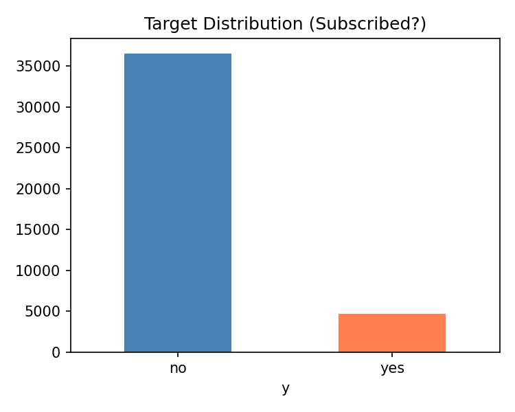

### Numeric Feature Distributions
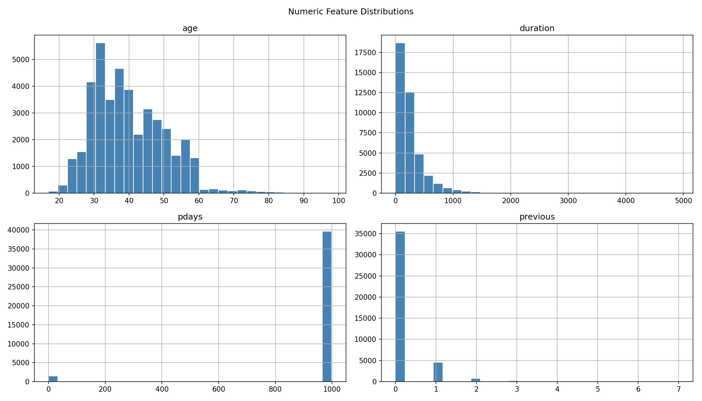

### Subscription Rate by Job
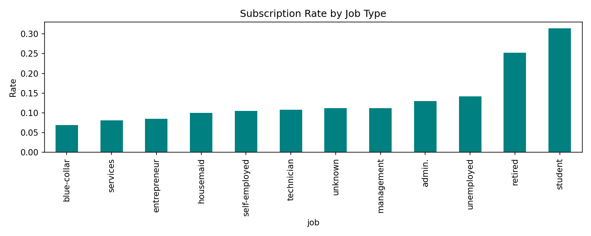

### Confusion Matrices
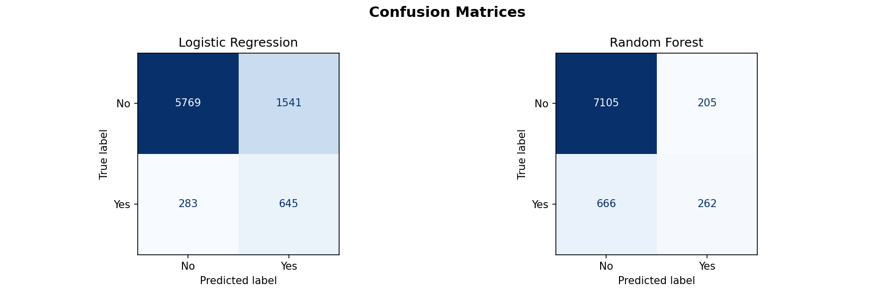

### ROC Curve
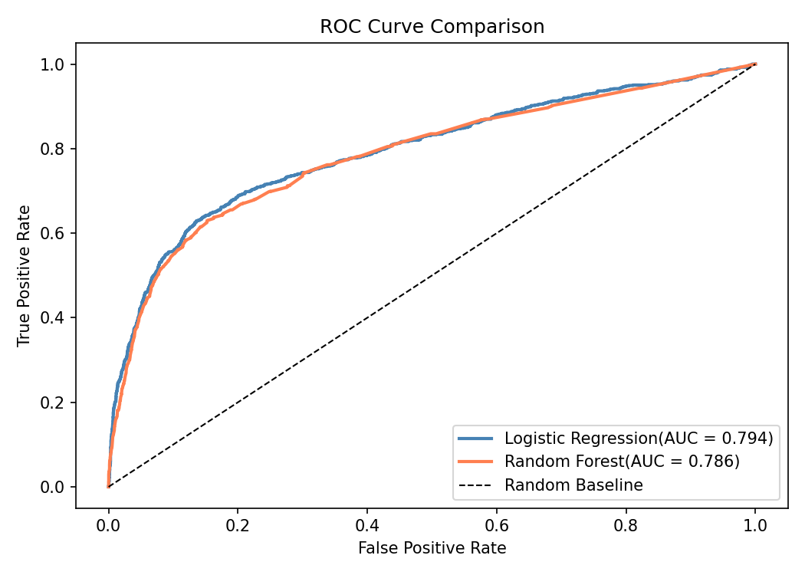

### SHAP Global Feature Importance
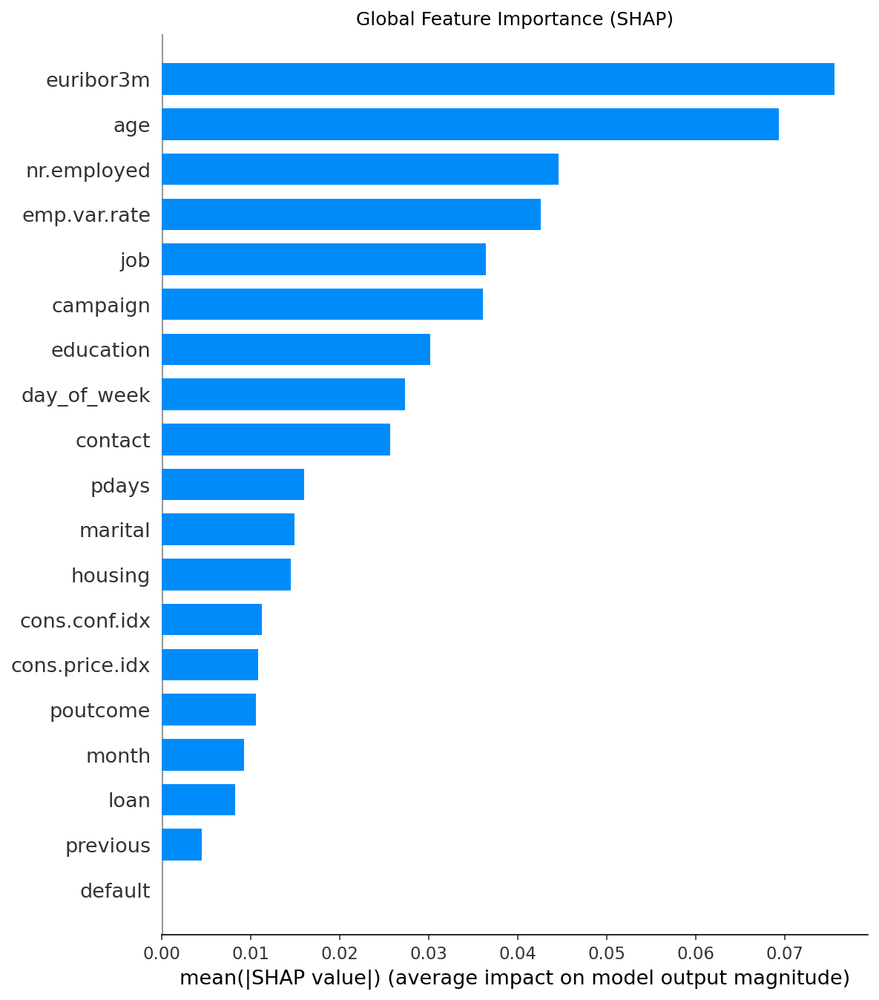

### SHAP Beeswarm Plot
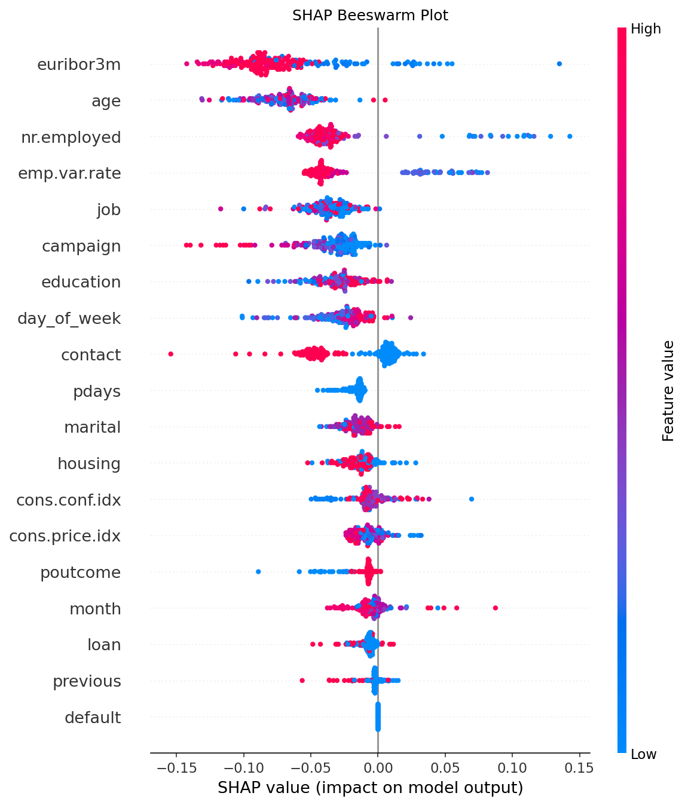

### SHAP Individual Predictions (Waterfall)
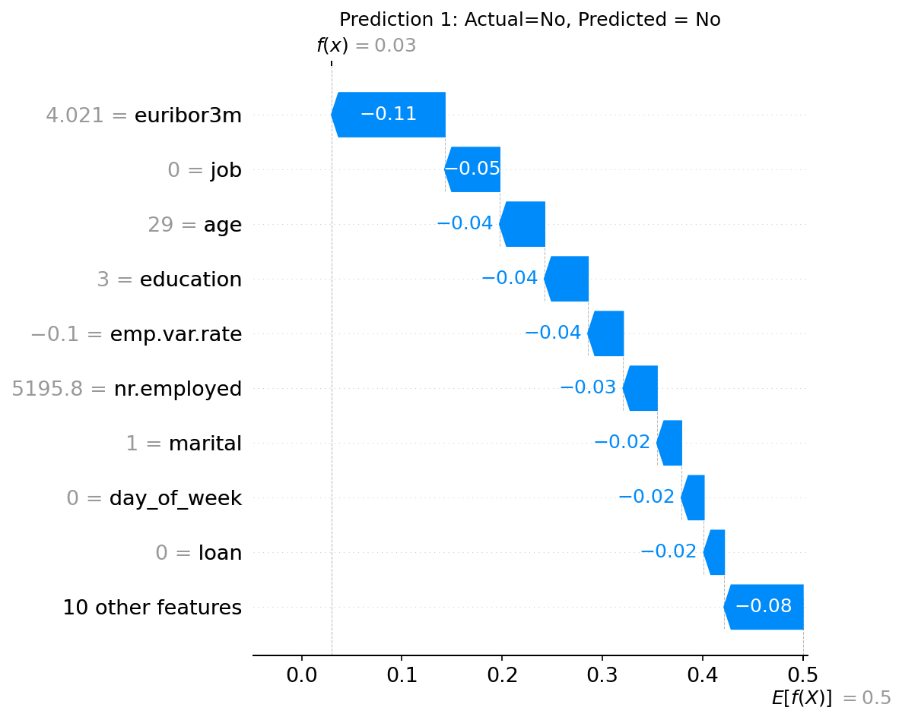
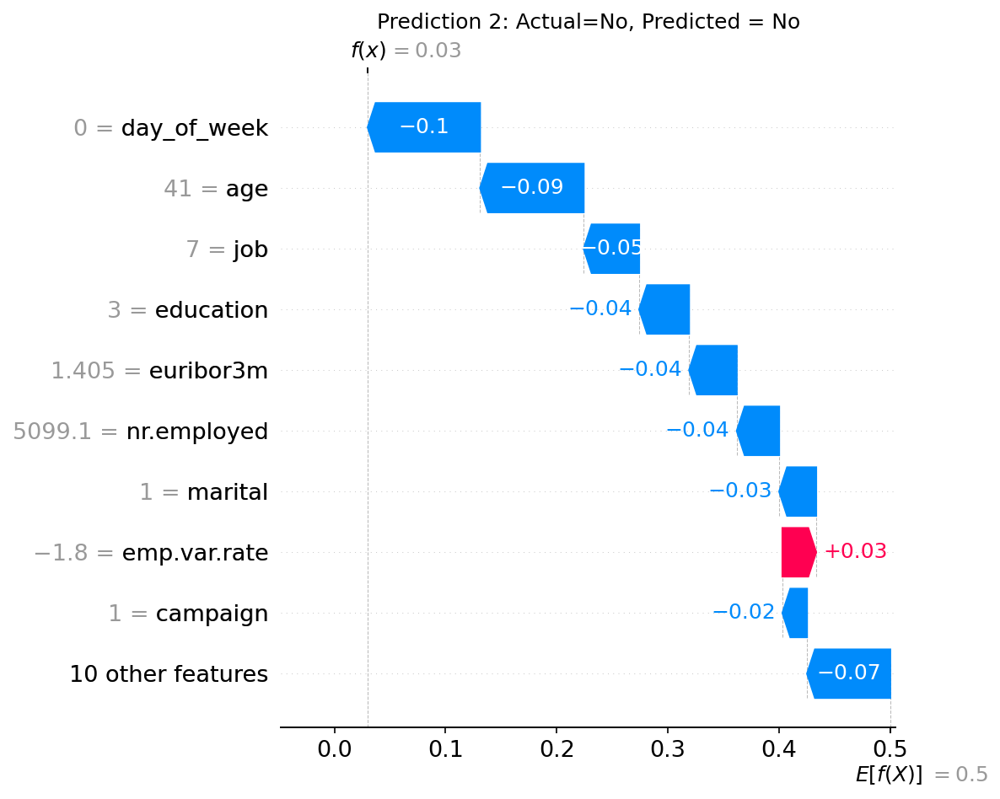
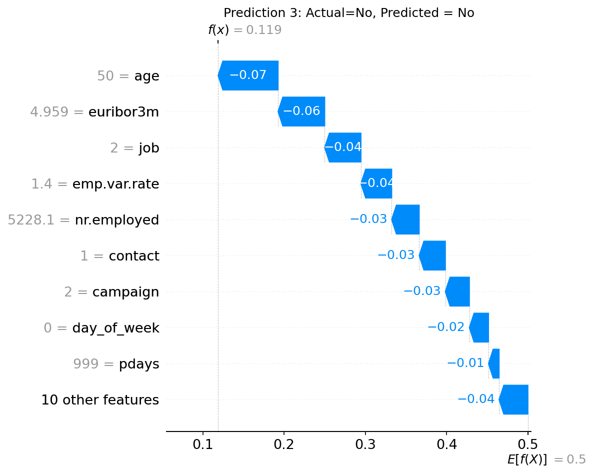
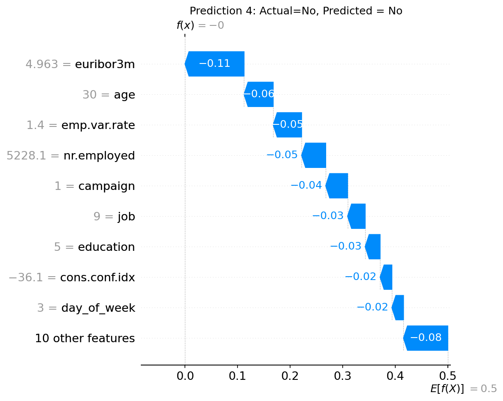
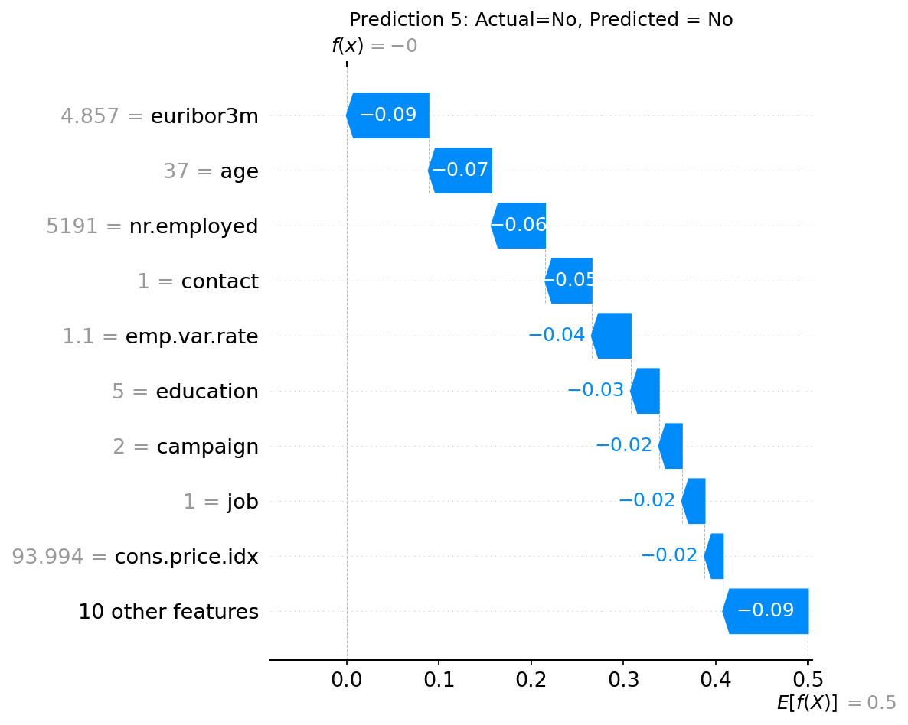


## Results

| Metric | Logistic Regression | Random Forest |
|---|---|---|
| AUC Score | YOUR_LR_AUC | YOUR_RF_AUC |
| F1-Score (Yes class) | YOUR_LR_F1 | YOUR_RF_F1 |

**Key Findings:**
- Random Forest outperformed Logistic Regression on both AUC and minority-class F1
- Top SHAP features: `nr.employed`, `euribor3m`, `poutcome`, `contact`, `month`
- Economic indicators have the strongest global influence on subscription likelihood
- Previous campaign success (`poutcome=success`) is the strongest positive predictor


## Skills Gained
- Classification modeling (Logistic Regression, Random Forest)
- Feature encoding & data leakage handling
- Model evaluation (F1, ROC-AUC, Confusion Matrix)
- Explainable AI like SHAP (global + individual predictions)
- Customer behavior analysis

---

## How to Run
```bash
pip install pandas numpy scikit-learn shap matplotlib seaborn ucimlrepo
```
Open `notebook.ipynb` and run all cells sequentially.

## Repository Structure
bank-marketing-classification/

├── notebook.ipynb
├── README.md
├── requirements.txt
└── plots/
├── confusion_matrices.png
├── roc_curve.png
├── shap_summary_bar.png
├── shap_beeswarm.png
└── shap_waterfall_1.png ... shap_waterfall_5.png

